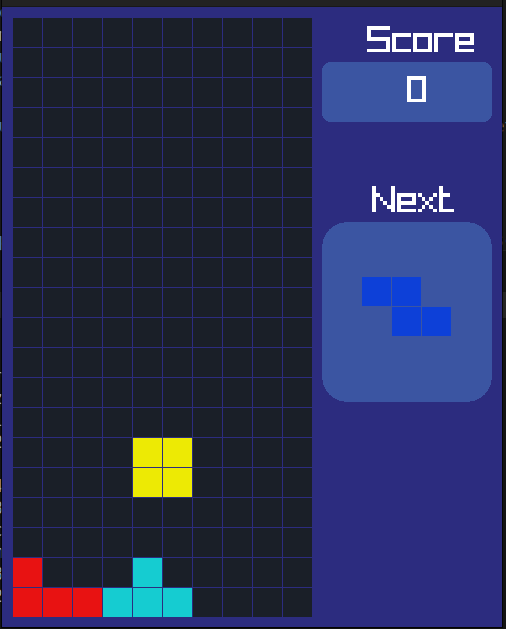
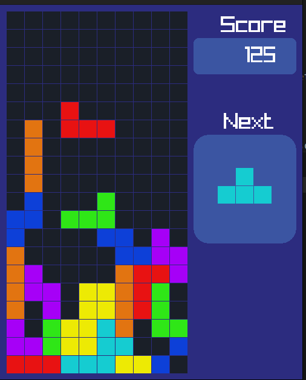
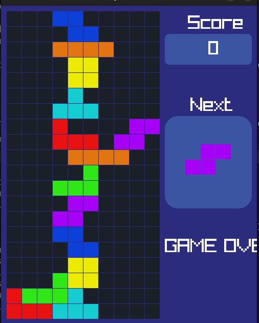

# 🎮 Tetris Game 🎮

A classic Tetris game implemented in C++ with a console-based interface.

## 📋 Table of Contents
1) Introduction
2) Features
3) Usage
4) Game Logic and Functions
5) Demo

## 🌟 Introduction

The **Tetris Game** project is a C++ console application that replicates the iconic Tetris game. It allows players to manipulate falling tetrominoes to clear horizontal lines and avoid filling up the grid. The game provides a fun and engaging way to practice and showcase programming skills in C++.

## 🔥 Features
1) **Classic Gameplay**: Traditional Tetris mechanics including piece rotation, movement, and line clearing.
2) **Scoring System**: Tracks the score based on lines cleared.
3) **Game Over Detection**: Ends the game when the grid is full.
4) **Real-time Interaction**: Responds to user inputs for smooth gameplay.
5) **Customizable Settings**: Easily adjustable grid size and piece speed.

## 🚀 Usage

To play the game, follow these steps:

1. **Clone the repository**:
   ```bash
   git clone https://github.com/AbuzarMeh/Tetris-Game.git
   cd Tetris-Game
Compile the game: Use the provided Makefile to compile the project:

bash
Copy code
make
This will generate an executable named tetris.

Run the game: Execute the program:

bash
Copy code
./tetris
Play and enjoy!

Controls:
Left Arrow (←): Move the tetromino left.
Right Arrow (→): Move the tetromino right.
Down Arrow (↓): Soft drop (increase falling speed).
Up Arrow (↑): Rotate the tetromino clockwise.
Spacebar: Hard drop (instantly drop the tetromino).
P: Pause or resume the game.
Q: Quit the game.
📚 Game Logic and Functions
Tetromino Class:
Handles the attributes and behavior of the tetromino shapes.

Attributes:

Shape matrix
Position on the grid
Methods:

rotate(): Rotates the tetromino clockwise.
moveLeft(): Moves the tetromino left.
moveRight(): Moves the tetromino right.
softDrop(): Moves the tetromino down by one row.
hardDrop(): Drops the tetromino to the bottom of the grid.
Game Class:
Manages the game loop, grid, and interactions.

Attributes:

Game grid
Current and next tetromino
Methods:

checkCollision(): Checks for collisions between the tetromino and the grid.
clearLines(): Clears complete lines and updates the score.
spawnTetromino(): Spawns a new tetromino.
gameOver(): Detects if the game is over.
Input Handler:
Processes user inputs for controlling the tetromino.

Methods:

processInput(): Maps keyboard inputs to corresponding game actions.
Main Loop:
Initializes the game grid and tetromino.
Updates the game state based on inputs and gravity.
Renders the grid and tetromino in real-time.
🎥 Demo
Game Start
plaintext
Copy code
Welcome to Tetris!
Press any key to start the game.
Playing the Game
Screenshot or description showing gameplay with tetrominoes falling and clearing lines.
Game Over
plaintext
Copy code
Game Over!
Your final score: 1234
Thank you for playing the Tetris Game!

🤝 Contributing
Contributions are welcome! If you'd like to enhance this game or fix any issues, please follow these steps:

Fork the repository.
Create a new branch: git checkout -b feature-name.
Make your changes and commit them: git commit -m 'Add new feature'.
Push to the branch: git push origin feature-name.
Submit a pull request detailing your changes.
📜 License
This project is licensed under the MIT License. See the LICENSE file for details.

kotlin
Copy code

## 🎥 Demo

### Game Start


### Playing the Gameelcome_screen


### Game Over

